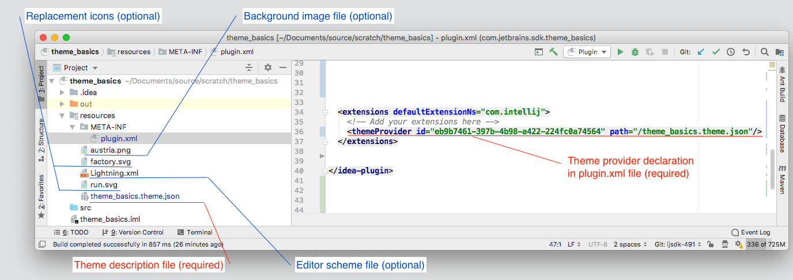

# Portfolio Proftaak

## Week 3

Deze week heb ik gewerkt samen met Martijn, maar na een tijdje kwam ik erachter dat het werk wat de andere aan het doen waren nodig was, voor mijn onderdelen. de rest was namelijk bezig met het maken van een functie om dingen toevoegen en ik moest dingen wijzingen.

Voor de comboBox van alle beschikbare tijden, was een hele was lijst met localdate times handmatig uitgeschreven, dit heb ik vervangen met een methode met een for loop, zo dat het makkelijk kan worden hergebruikt.

de klaslokalen stonden niet in schedule daardoor als klaslokalen waren aangemaakt maar niet waren gebruikt werden ze niet opgeslagen, omdat alleen schedule werd opgeslagen, en ze stonden daar niet in, dit is opgelost door een arrayList toe toevoegen van klaslokalen en mee te geven met de constructor.

Er was een vbox met standaard spacing en padding, deze werd heel vaak gekopieerd en her gebruikt, dus heb een methode gemaakt waar je alle nodes aan kan meegeven en die zo'n vbox terug geeft, zodat je niet heel veel duplicaten code hebt.

deze week is goed verlopen en alles was af voor de deadline.
## Week 4

deze week heb ik ervoor gezord dat lessen minimaal een half uur kunnen zijn, en dat dat ook juist word weergegeven.

terwijl ik bezig was heb ik ook nog meegeluisterd en input gegeven op het ontwerp van de simulatie module.

er miste een zwarte lijn aan het eind van een les dit kwam omdat er een grijze rechthoek overheen werd getekend, maar het omdraaien ging ook niet want dan stond er een lijn halverwege lessen die 2 tijd increments duren, de fixs was rechthoek 1 pixel kleiner maken zodat het er niet overheen werd getekend.

##### Van Arraylist naar ObservableList 
we gebruikte eerst overal een arraylist voor, dit zorgde er alleen voor dat zodra er iets van data werd veranderd, dat we dan ook het rooster handmatig moest vertellen dat er iets veranderd was. Een Observable list doet dit automatisch hierdoor word de listview met alle lessen automatisch geüpdatet als er een les is toegevoegd.
de makkelijkste manier om dit aan te passen, was het aanpassen van de klassen schedule, maar wel zodat alle code die werkt met deze klassen wel blijft werken, in de klassen schedule zaten namelijk al die verwijder en toevoeg functies. deze heb ik aangepast om te werken met observable lists

    private ArrayList<Lesson> lessonArrayList;
    private ObservableList<Lesson> lessonObservableList;
    
    public Schedule(ArrayList<Lesson> lessons, ArrayList<Teacher> teacherArrayList, ArrayList<Group> groupArrayList)
    {
        this.lessonArrayList = lessons;
       
        this.lessonObservableList = FXCollections.observableList(lessons); //deze lijn heb ik toegevoegd zodat de obserable list de Arraylist Gebruikt om zijn gegevens op te slaan
   
    }
    public void removeLesson(Lesson lesson) //deze methode hoefde ik alleen maar lessonArrayList aan te passen naar lessonObservableList
    {
            lessonObservableList.remove(lesson);  
    }
het was dus makkelijk toe te passen door bij de verwijderd methodes de arraylist te vervangen voor de observable list.

deze week was vooral veel uitzoek werk en deels trail en error, om het goed werkende te krijgen, hierdoor is de code van deze week niet het mooiste geworden.

##week 5

deze week moest ik een tijdsysteem gaan maken, waarmee we de tijd van de simulatie konden zien, en dan de  huidige lessen bij dit tijdstip kunnen ophalen.
ook moet er verschillende tijdsverlopen mogelijk zijn, zoals versneld.

TimeManager is het onderdeel wat je gebruikt om de "Huidige" tijd te krijgen van simulatie, 
deze klassen heeft een TimeType, dit is een klassen van de Interface TimeType. TimeType bevat de volgende dingen:
* getTime //hiermee vraag je de "huidige" tijd op
* update  //hiermee update je de tijd met een deltatime
* getSpeedFactor // hiermee krijg de versnellings factor, 1 als hij niet versneld word.

om te testen had ik een deltatime nodig, maar mijn code was nog niet gekoppeld aan de animatieTimer dus moest even mijn eigen functie maken om het te testen
    
       
     private Long lastTime;
     
     public long deltaTime()
    {
        long deltaTime = LocalTime.now().toNanoOfDay() - lastTime;
        lastTime = LocalTime.now().toNanoOfDay();
        return deltaTime;
    }
      
het verloop van tijd achteruit verschild heel weinig van de normale tijd enigste verschil is dat de deltatime negatief is, hierdoor word er een negatief getal toegevoegd aan de tijd en dus loopt de tijd achteruit.

om de huidige lessen om te halen, word een al bestaande methode gebruikt, deze was origneel bedoeld om met de begin en eindtijd van een les te kijken welke lessen er tijdens die tijd nog meer plaats vinden, maar als je hier de huidige tijd 2 maal instopt krijg je alle lessen die bezig zijn op dat moment.

#week 6
deze week heb ik gewerkt samen met luuk, voor een deel. we zijn aan de slag gegaan met het samenvoegen van de het tekenen van npc's en het tijdsysteem
dit zorgt ervoor dat npc's op de juiste locaties worden getekend op het juiste moment.

ook heb ik er voor gezorgd dat als je klas vult met leerlingen dat je geen dubbele krijgt.

    public boolean addStudent(Student student)
    {
        if (!students.contains(student))
        {
            students.add(student);
            return true;
        }
        return false;
    }

#week 7

bug gefixed dat 10 uur werd geskipped, kwam omdat er niet naar veranderingen werden gekeken tijd een les.

het viel me op dat dezen les gebeurde tijdens een andere les. dus dat is waar ik begon met kijken, en toen 
zag ik dat de check voor wanneer de volgende actie was niet kloptie want die pakte alle lessen van het huidige tijdstip en keer naar het eerst volgende eindtijd of begin tijd welk ook eerder was, maar in 
deze lijst zaten dus nog niet de lessen die nog moeste beginnen, hierdoor werden deze niet megenomen, dit heb ik gefixed door de tijd die gecontrolleerd word uittebreiden dus er word gecheckt vanaf de begintijd van de huidige les tot de eindtijd.

    public ArrayList<Lesson> getCurrentLessons()
    {

        lessons = schedule.getOverlappingLessons(getTime());
        nextChange = null;\\\\\
        for (Lesson lesson : lessons)
        {
            LocalTime endTime = lesson.getEndTime();
            if (nextChange == null || endTime.isBefore(nextChange))
            {
                nextChange = endTime;
            }
        }

        if (nextChange == null || schedule.nextLesson(timeType.getTime()).isBefore(nextChange))
        {
            nextChange = schedule.nextLesson(timeType.getTime());
        }

        return lessons;
    }
    
 schedule.nextLesson(timeType.getTime()).isBefore(nextChange) deze regel zorgt ervoor dat als er een les verandering is tijdens een les dat deze dan alsnog word meegenomen.

zo is het er uit eindelijk uit komen te zien, met de tijd bovenin in het midden, en rechtsonder de knoppen om de tijdsverloop aan te passen, en een knop om terug te gaan na het laatste kwartier.

#week 8 

Deze week heb ik gewerkt aan het terugspoelen van de tijd, er waren meerdere manieren om dit te doen. het eerste idee was gewoon de tijd achteruit laten lopen
dan gaan mensen gewoon het rooster verkeerde kant op af, maar dit zorgt veel problemen, zoals onderandere dat de mensen nog wel vooruit lopen, en dat er veel bugs onstaan met de deltatime
waardoor mensen door de muren heen gaan lopen en vast blijven zitten. 
de optie waar ik uiteindelijk voor heb gekozen is elk kwartier alle npc's te clonen, en dan in een nieuwe npc manager te stoppen, en deze dan in een map samen met de tijd op te slaan.

    public void saveNPCs()
    {
        NPCManager newNpcManager = new NPCManager();

        for (NPC npc : this.npcManager.getNpcs())
        {
            newNpcManager.addNPC(npc.clone());
        }
        timeNPCManagerMap.put(timeManager.getTime(), newNpcManager);

        System.out.println("npcs saved");

    }
hier kan je zien hoe het opslaan gebeurd, maar dat is maar het eerste deel van terug in de tijd kunnen, het andere deel het inladen van een geschienis punt is natuurlijk ook belangrijk.

#javaFX in het bedrijfsleven

javaFX is een java libary die we hebben gebruikt tijdens deze periode, deze libary word niet alleen maar gebruikt op scholen en tijdens het leren van java
maar word waarschijnlijk ook gebruikt in het bedrijfleven, dit word onderzocht op verschillende manieren. Ten eerste word javaFX wel echt gebruikt, ten Tweede waarom word het dan gebruikt, en als laatste hoe wordt het dan gebruikt

##Gebruik van javaFX
 van een persoon zelf thuis met een raspberry pi tot een bedrijf zo groot als nasa gebruikt javaFX, bij nasa werd javaFX namelijk gebruikt
 voor het NASA James Webb Space Telescope Flight Dynamics Ground System. (Borges, 2017)

##CrossPlatform
javaFX is CrossPlatform.
dit houd in dat voor verschillende platformen zoals (Windows, macOS, linux) dat je geen nieuwe code hoefd te schrijven, en het meteen zou moeten werken. (RayalSloth, 2020)

dit zorgt binnen het bedrijfsleven dat er niet extra geprogrammeerd hoefd te worden voor verschillenden platformen en dit bespaard weer geld.

ook als er dan ergens een wijzigeging word gemaakt, dan hoef je dat niet voor elk systeem los te doen.

##Verbinding met andere systemen
ook word javaFX vaak gebruikt om dat het in Java geschreven, dit maakt het makkelijk om te koppelen aan andere systemen. 

Dit gebeurd dan vaak in 1 van de volgende 2 manieren(Oracle, 2013)
* Thin Client Architecture
* Thick Client Architecture

bij thin word java en javaFX alleen maar gebruikt om de data te tonen, vaak word de data ontvangen door zoeits als json, en bijna direct getoond zonder teveel berekkeningen.

bij thick, word er ook gebruikt van api calls, ook heeft de applicatie ook de meer mogelijkheden dan alleen het tonen de data, het kan het ook wijzingen verwijderen en toevoegen.

##conclusie

ja, JavaFX wordt echt gebruikt in het bedrijfs leven, bedrijven zo groot als nasa gebruiken het.
het wordt vooral gebruikt omdat het crossPlatform is, dus geen nieuwe code voor een ander platform.
de manier waarop JavaFX gebruikt is meestal als front-end van een server of DataBase.
het is dus wel duidelijk dat javaFX is door een hele breede groep mensen word gebruikt, waaronder dus ook het bedrijfsleven.

# Json in Applicaties

##GTA V
Hoe weet ik dat, nou GTA V was laatst in het nieuws doordat een fan een manier had gevonden om de laadtijden van GTA Online te versnellen.

De GTA 5-fan plaatste zijn bevindingen online nadat hij erin was geslaagd de laadtijden met ongeveer 70% te versnellen.  De korte versie is dat hij een CPU-bottleneck met één thread gevonden heeft tijdens het opstarten van GTA Online. De komt omdat GTA V moeite heeft om een 10 MB JSON-bestand te ontleden, aangezien de JSON-parser slecht gemaakt was. 
(t0st,2021)

## Rest Api

Rest Api's zijn een van de meeste gebruikte api's van het web heel veel andere applicatie's maken daardan weer gebruik van. 
bijvoorbeeld spotify kan dan op je mobiel zien wat er op de pc word afgspeeld door middel van deze api. Maar api's worden overal gebruikt.

hier uitleg over hoe Rest te werk gaat.

Wanneer een clientverzoek wordt gedaan via een REST API. Stuurt dit eerst de huidige status naar het eindpunt. Deze informatie wordt geleverd in een van de verschillende formaten via HTTP: JSON (Javascript Object Notation), HTML, XLT, Python, PHP of platte tekst. JSON is de meest populaire programmeertaal om te gebruiken.
(Redhat, z.d.)

#Intelij

Intelij is een applicatie waarmee je java kan programmeren, en waar ook deze markdown in is geschreven, maar voor hoe deze applicatie eruit ziet
kan je een thema gebruiken, de omschrijving van deze thema's staan een json file

# bron vermelding
Sad state of cross platform GUI frameworks. (2020, 16 maart). RoyalSloth. https://blog.royalsloth.eu/posts/sad-state-of-cross-platform-gui-frameworks/#javafx

oracle. (2013, 1 maart). Why, Where, and How JavaFX Makes Sense. https://www.oracle.com/technical-resources/articles/java/casa.html

T. (2021, 28 februari). How I cut GTA Online loading times by 70%. Nee. 

Redhat. (z.d.). What is a REST API? https://www.redhat.com/en/topics/api/what-is-a-rest-api

Borges, B. (2017, 26 juli). Podcast: From Raspberry Pis to Deep Space JavaFX. oracle. https://blogs.oracle.com/developers/podcast-from-raspberry-pies-to-deep-space-javafx