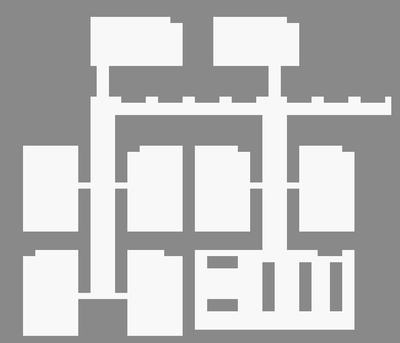
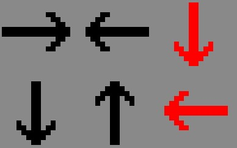
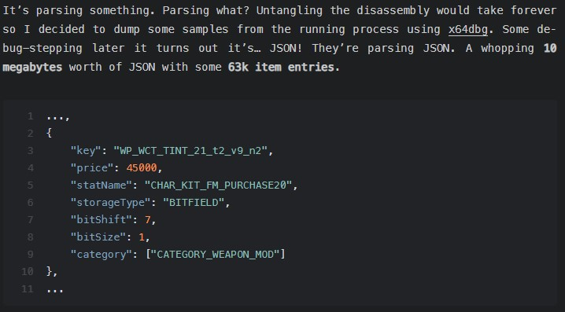

#Portfolio Periode 1.3 - Leon van der Sar
##Week 3
Deze week heb ik samen met Luuk en Eddy ervoor gezorgd dat Data is gekoppeld aan de GUI,hier kwam ik tijdens het werken er wel achter dat ik kan ook meteen moest zorgen dat er nieuwe leraren, studenten en klassen aangemaakt moesten worden.
Hier heb ik dus het grootste deel van de tijd aan gewerkt door af en toe nog een getter of setter toe te voegen aan de code. Ik heb dit voor elke variabele gedaan sinds ik niet heel zeker was wat er in de toekomst wel en niet gebruikt zou worden, ook zou het misschien later problemen geven met het opslaan en laden. Daarom leek mij dit het beste om te zorgen dat hier later geen problemen mee kwamen.

Ook heb ik ervoor gezorgd dat er een nieuwe klasse is gemaakt voor het laten verschijnen van een error zodat wanneer er niet aan een requirement werd voldaan dat het dan ook goed aangegeven werd.
Dit vond ik vooral handig om toe te voegen voor de rest van het proces sinds er soms fouten voor kunnen komen.

Deze week had ik dus vooral simpel werk gekregen en had ik er dus eigenlijk geen problemen mee gekregen sinds het simpele getters en setters zijn met wat JavaFX om te zorgen dat het goed op de GUI tevoorschijn komt.

##Week 4
Deze week ben ik vooral bezig geweest met het maken van de tiledmap sinds ik vooral nog moest wennen aan het programma tiled.
Ik ben aan het begin heel veel bezig geweest met het zoeken van een goede tileset en dit bleek een stuk moeilijker dan gedacht.
Ik had namelijk een paar requirements gezet:

- Het moet bij elkaar passen, anders is het niet mooi
- Er mag niet te veel detail in zitten.
- Er moet decor zijn zodat de klaslokalen niet te saai zijn.
- Het moet tafels hebben en een bord.

Na deze requirements gesteld te hebben begon ik dus met mijn zoektocht en kwam ik erg veel tegen ,maar de ene keer was er geen decor en de andere keer was was het niet mooi of paste het niet bij elkaar.
Maar na een paar uur zoeken kwam ik uiteindelijk bij een goede tileset die mij erg goed leek te zijn.

De tileset:
[Tilemap](https://limezu.itch.io/moderninteriors)

Deze tileset leek mij goed te voldoen aan de eisen, sinds het 16 bij 16 tiles heeft, het allemaal bij dezelfde tileset hoort en het heeft ook nog decor inclusief de tafels en het schoolbord.
Ik was hier erg blij mee en ik begon meteen met het maken van de map en uiteindelijk kwam ik met dit ontwerp:

De moeilijkheid van deze week was vooral het zoeken naar een goede tileset wat vrij lang duurde, maar daarnaast was het ook vooral de map maken sinds als ik een nieuw lokaal had gemaakt dat het dan ook echt goed lag, want als het ook maar 1 tile te ver lag dan kon ik niet alles 1 tile verplaatsen maar moet ik het handmatig allemaal goed zetten.
Dit vond ik erg vermoeiend en hierdoor duurde het ook erg lang naar mijn mening. Maar na al dat gedaan te hebben is het mij uiteindelijk goed gelukt een goede map te maken die er ook nog eens fatsoenlijk uit ziet.

##Week 5
Deze week ben ik aan de slag geweest met het verplaatsen van de camera en het zoomen van de camera. Hier moest ik even nadenken hoe ik het ging doen sinds ik niet precies meer wist hoe ik het best kon zoomen.

Na wat te hebben zitten testen heb ik een manier gevonden om in te kunnen zoomen. Dit is namelijk door de canvas te scalen. Dit kon ik doen door methodes te maken die kijken of er gescrolld wordt met de muis en nog een andere methode die dit doet maar dan voor het slepen van de muis. Ik kon ook kiezen om ales in de ccanvas te scalen in plaats van de canvas zelf, maar dit was mij tijdens het testen niet gelukt, dus ik had gekozen om de canvas zelf te scalen sinds dit praktisch hetzelfde is en geen problemen gaf.

Ik begon als eerste met het zoomen, hier was het vooral spelen met cijfers en het finetunen om ervoor te zorgen dat het werkte zoals het zou moeten werken.

Daarvan kwam dit eruit:

    double zoomFactor = 1.05;
    double deltaY = event.getDeltaY();
    
    if (deltaY < 0)
    {
        zoomFactor = 2.0 - zoomFactor;
    }

    if (!(node.getScaleY() * zoomFactor > 5) && !(node.getScaleY() * zoomFactor < 1))
    {
        node.setScaleX(node.getScaleX() * zoomFactor);
        node.setScaleY(node.getScaleY() * zoomFactor);
    }
    
Ik heb gekeken naar wat het verschil is in de verandering van de muiswiel en dit geef ik mee aan deltaY, gaat de code verder en kijkt of deltaY negatief is of niet sinds als je naar een andere kant scrolt dat je niet wilt dat hij precies hetzelfde doet en zet hij hierbij dus de zoomfactor op 0.95 volgens de code hierboven
Hierdoor wordt de canvas verkleind en als de zoomfactor normaal 1.05 is dan wordt het dus steeds groter.

Om ervoor te zorgen dat er niet te ver in- en uitgezoomd kon worden heb ik een if statement neergezet die ervoor zorgt dat de canvas niet te groot of te klein wordt.
Als daaraan wordt voldaan dan wordt de canvas pas groter of kleiner gezet worden.

Waarom ik heb gekozen om dit in aparte methodes te zetten is omdat deze functies misschien ook ergens anders nodig zijn en leek het mij handig om deze van tevoren deze apart te zetten. Ook is het handig om zo weinig mogelijk code te hebben staan in de start methode zelf om het overzichtelijk te houden.

##Week 6
Deze week ben ik aan de slag gegaan met het aangeven waar NPC's kunnen lopen en zitten met de rotatie van de zitplaats. Hier moest ik in Tiled gaan werken en gaan nadenken hoe ik ervoor zorg dat ik makkelijk kan aangeven waar NPC's kunnen lopen. Hier kwam ik uiteindelijk op de conclusie dat het het beste is dat ik of de gebieden aangeef waar NPC's kunnen lopen of waar ze juist niet kunnen lopen.
Ik vond het zelf makkelijker om aan te geven waar ze wel konden lopen en ging ik aan de slag, uiteindelijk kwam ik bij dit uit:

Dit is gewoon dezelfde map als de normale map, maar dan alles in het wit en wat dingen weggehaald waar NPC's niet zouden mogen lopen zoals door beoekenkasten, muren etc.

Verder moest ik ook gaan zorgen dat ik kon aangeven hoe en waar NPC's moesten zitten om te zorgen dat er geen rare dingen gebeuren. Hier was voor mij de uitdaging om een goede en makkelijke manier te vinden om het aan te kunnen geven zonder mij te verwarren. Hier kon ik kiezen om al bestaande tiles uit de tileset te gebruiken, maar dat is niet heel makkelijk om voor mij te onthouden welke tichting wat is en het is minder makkelijk voor mijn groepsgenoten, dus ik koos ervoor om pijlen te gebruiken, en hier ging ik naar op zoek.

Na een tijd zoeken kon ik niks vinden en besloot ik om zelf maar een tilemap te maken met 6 pijlen, 4 voor de rotatie van leerlingen en 2 voor leraren speciaal. Ik heb 2 voor de leraren gedaan vanwege het feit dat de stoelen van leraren maar 2 verschillende kanten op stonden, waardoor ik minder moeite hoefde te doen om de andere 2 pijlen te maken en tijd kon besparen.
De pijlen zien er als volgt uit:

Bij deze afbeelding is er duidelijk een verschil met de pijlen voor de leerlingen en leraren doordat de leraren rode pijlen hebben en leerlingen zwarte pijlen hebben. Dit voorkomt dat leraren niet op stoelen van leerlingen gaan zitten en zorgt ervoor dat een stuk minder werk nodig is, dopordat het een stuk makkelijker onderscheid is te maken tussen de stoelen van leraren en leerlingen.

Na alle pijlen te hebben gemaakt kon ik makkelijk alles gaan plaatsen en had ik alle stoelen een pijl gegeven zodat leerlingen of leraren erop konden gaan zitten.

##Week 7
Deze week was een van mijn opdrachten om te zorgen dat de namen van lokalen aangepast konden worden. Hier moest ik het een en ander gaan aanpassen in de GUI en in de datastructuur zelf.
Ik moest in de klasse Classroom zorgen dat er een private variabele was die aangaf wat de naam was van de classroom zelf sinds het nu alleen een nummer had. Ik had besloten om te zorgen dat de naam alleen wordt laten zien als naam in de GUI en meer niet, het nummer bleef hetzelfde en is in feite het ID waaraan het lokaal herkend kan worden. In de klasse Classroom moest ik ook nog de constructor aanpassen en een nieuwe getter en setter maken, maar daarna was het werk in die klasse klaar.

Toen ik even nadacht kwam ik tot de conclusie dat dat nog niet alles was. Ik moest nog zorgen dat de naam ook echt aanpasbaar was en dat de naam van het klaslokaal weergeven moet worden in de GUI.
Hier moest ik gaan kiezen tussen twee opties om het te doen:
1. Een pop-up op laten komen om de naam van het klaslokaal aan te kunnen passen
2. In de GUI zelf een nieuwe tab aanmaken waar de namen veranderd kunnen worden

Ik ging hier voor optie 2 omdat het minder logisch was om een pop-up op te laten komen als alle andere dingen die bewerkbaar zijn in tabs staan.
Ik had hier niet heel veel voor moeten doen, de code van een al bestaande tab kopiëren en het bewerken zodat een klaslokaal aangepast kon worden.
Het leek mij het handigste om een listview neer te zetten met alle verschillende klaslokalen en met hun echte naam in plaats van hun nummer. Als een lokaal geselecteerd werd dan werd de informatie laten zien en kon het bewerkt worden.
Dit was makkelijk te doen door een textfield te plaatsen en door te zorgen dat hier de naam in staat wanneer er een klaslokaal geselecteerd is. Met natuurlijk een knop erbij om te zorgen dat de verandering uitgevoerd wordt wanneer de gebruiker tevreden is met de naam.

##Week 8

Deze week ben ik aan de slag gegaan met het zorgen dat NPC's niet in elkaar spawnen. Hier moest ik een systeem voor maken die kijkt waar NPC's zijn en alleen een nieuwe NPC spawnt wanneer de afstand groter is dan 16.
Hier had ik even kort over nagedacht en kwam bij het twee ideeën: 

1. Dat er een methode gemaakt moet worden die spawnlocaties aanmaakt binnen het spawngebied en die toevoegt aan een lijst.
2. Bij het aanmaken van NPC's een plek meegeven waar zij mogen spawnen en deze plek tijdelijk onthouden.

Ik ben voor optie 1 gegaan met deels optie 2 erbij. Hier wordt de locatie meegegeven met de NPC en is elke locatie bezet zolang er een NPC op staat. Ik ben hiervoor gegaan sinds dat mij dat het beste leek sinds een timer zetten op een locatie niet heel goed kan zijn sinds er dan nog een NPC op kan staan, daarom moet er een check zijn of er iets op staat, dat is waarom ik ben gegaan met optie 1 met een deel optie 2.

Ik mocht dus beginnen aan een methode maken die locaties toevoegt aan een lijst. Deze lijst wordt later gebruikt om te kijken welke van deze coordinaten goede coordinaten zijn met minimaal een afstand van 16 van de dichtsbijzijnde NPC.
Dat had ik gedaan aan de hand van twee methodes, getAvailability is een recursieve methode die een nieuw spawnlocatie genereert en kijkt of de afstand tussen het meegegeven punt, in dit geval de locatie van 1 NPC en de gegenereerde locatie groter is dan 16. Als dat zo is is de eindconditie bereikt en geeft hij het punt terug. Anders roept de methode zichzelf weer op en wordt een nieuwe locatie gegenereerd.
De tweede methode getFullAvailability is de methode die een lijst krijgt met alle gegenereerde locaties en een lijst met alle locaties van NPC's. Wat hier gebeurt is dat er voor elke gegenereerde locatie wordt gekeken of die van elke NPC een grotere afstand heeft dan 16, als dit zo is wordt het toegevoegd aan een lijst. Elke keer dat deze methode wordt aangeroepen wordt het eerste punt in de lijst meegegeven.

Hier de code van de gebruikte methodes en de methodes die de locaties genereren:

    public void generateComponents() {
        xComponent += 16;
        if (xComponent > 1575) {
            xComponent = 1310;
            yComponent += 16;
        }
    }

    public int yComponent(){
        if (yComponent > 750){
            yComponent = 450;
        }
        return (int)yComponent;
    }
    
    public Point2D getAvailability(Point2D location) {
        generateComponents();
        if (location.distance(new Point2D.Double(xComponent, yComponent)) > 16) {
            return new Point2D.Double(xComponent, yComponent);
        } else {
            return getAvailability(location);
        }
    }

    private ArrayList<Point2D> fullAvailableLocations = new ArrayList<>();

    public Point2D getFullAvailability(ArrayList<Point2D> currentLocations, ArrayList<Point2D> availableLocations ) {
        if (!fullAvailableLocations.isEmpty()) {
            fullAvailableLocations.remove(0);
        }

        for (Point2D location : availableLocations){
            for (Point2D currentLocation : currentLocations) {
                if (currentLocation.distance(location) > 16 && !fullAvailableLocations.contains(location)) {
                    fullAvailableLocations.add(location);
                }
            }
        }
        return fullAvailableLocations.get(0);
    }

#Reflectie over stellingen van het bedrijfsleven

In dit onderdeel heb ik de keuze uit twee onderwerpen gekregen waar ik een refelctie inclusief onderbouwing mag gaan geven, de onderwerpen zijn de volgende:

- “In het bedrijfsleven wordt gebruik gemaakt van JavaFX”, 
- “In het bedrijfsleven wordt steeds meer in software gesimuleerd”

Ik heb gekozen uit het tweede onderwerp. Dit komt doordat ik net iets meer weet over de stelling en ik ben er iets meer geinteresseerd in omdat daar vaak veel werk in wordt gestopt en het veel impact kan hebben.
Daarom lijkt het mij het leukste om deze stelling te behandelen.

##Voordelen van het simuleren in software
Sinds computers de afgelopen jaren steeds beter zijn geworden en er elk jaar verbeteringen in zitten die de rekenkracht nog beter maken van computers is het simuleren ook elk jaar zelf een stuk praktischer geworden door de daling van prijzen
vanwege het gebruik van stroom en onderdelen. Vanwege dit is het simuleren van bepaalde dingen een steeds betere keuze geworden. Zo kunnen moeilijke berekeningen binnen een seconde gedaan worden in plaats van dat iemand daar een halfuur over doet of zelfs langer.
Dit geeft natuurlijk een groot voordeel aan het simuleren van iets sinds niet alles handmatig berekend meer moet worden. Maar naast het berekenen kunnen er ook veel meer dingen gedaan worden.
Een simulatie is een nabootsing van het echte leven en worden er bepaalde dingen getest zoals wat de beste vorm is voor een aerodynamische auto of hoeveel kracht er nodig is om iets voort te bewegen.
Dit zijn allemaal dingen die getest kunnen worden in het echte leven en die kunnen veel goede data opleveren, maar het nadeel ervan is dat het tijd en dus geld kost.
Hierdoor is het simuleren van een omgeving een erg efficiënte keuze omdat het geen mensen nodig heeft en het kan allemaal heel snel gedaan worden.

Dit komt vooral door het feit dat zoals ik eerder heb genoemd het een stuk praktischer is om te simuleren dan in het echte leven het uittesten.
Alhoewel er wel goede code geschreven moet worden om te zorgen dat de berekeningen ook echt goed de wereld voorstellen, sinds er maar een fout gemaakt hoeft te worden
om de simulatie niet meer de wereld correct voor te stellen. Dit kan echter wel opgelost worden door te zorgen dat er goede tests gemaakt zijn.

Het simuleren van dingen heeft een groot voordeel in het bedrijfsleven waar er wordt gewerkt aan het verbeteren van technologie en waar er onderzoek wordt gedaan.
Dit komt doordat er vaak dingen worden getest die nog niet echt bestaan, maar wel willen gaan kijken of het een goed materiaal of product is die geproduceerd kan worden.

Als ik een voorbeeld ga noemen van een scenario waar simulaties steeds meer gebruikt worden is het het simuleren van proteines.
Ongeveer een jaar geleden is er een nieuwe vorm van simuleren aan het licht gekomen, deze vorm is een groot netwerk van computers waar de eigenaars toestemming geven om de computer simulaties te laten berekenen.
Deze methode heet Folding@Home, Folding@Home is een open-source project die erg populair is geworden doordat dat elk persoon met een computer en een internetconnectie kan meehelpen met simuleren.
Dit is zo groot geworden dat de gecombineerde kracht is sterker dan de nummer 1 supercomputer van de wereld in 2020(Patrizio, 2020). Dit is een erg goede indicator dat het simuleren van proteines een erg groot is en ook een goede model is doordat dit alleen een project is dat naast heel wat andere supercomputers loopt en meehelpt met het zoeken naar medicijnen voor ziektes.

##Conclusie
Ik denk dat er in het bedrijfsleven inderdaad steeds meer in software wordt gesimuleerd, doordat het simuleren van erg complexe proteines al en goed business model is zou ik de conclusie kunnen trekken dat simulaties van minder complexe simulaties ook een goede keuze zou zijn voor bedrijven, waardoor simuleren ook steeds meer wordt gebruikt.

##Applicaties die het JSON format gebruiken
In meerdere programma's wordt het JSON format gebruikt. Hier een lijst met de programma's samen met wat ik denk waarvoor JSON wordt gebruikt.
###Websites die gebuik maken van Ajax

Websites die gebruik maken van Ajax gebruiken ook JSON of XML, maar vaker wordt voor JSON gekozen als datastructuur.
JSON wordt hier gebruikt om data op te slaan die door Ajax geupdated wordt.

###Tiled

In tiled wordt JSON optioneel gebruikt om de data in op te slaan. Hier wordt de map in opgeslagen met de path naar de tilesets toe en de plaatsing van de tiles zelf met mog wat andere extra informatie zoals welke layer wat staat.

###Minecraft,
 In minecraft wordt JSON door meerdere dingen gebruikt:
 - Het opslaan van data van signs met de tekst en commands.
 - Voor resource packs en data packs waarin nodige informatie staat voor die packs.
 - Voor het opslaan van statistieken, versie informatie en data voor de launcher.

###GTA V

Een paar weken geleden kwam er bij mij in het nieuws voorbij dat een GTA V fan een manier had gevonden om de laadtijden te versnellen.

Die fan had na wat onderzoek gedaan te hebben in de code van het laden van GTA V online bevonden dat GTA moeite had met het laden van een JSON bestand. Dit had hij kunnen oplossen door kleine aanpassingen te maken in de code. (t0st, 2021)

Hier is een foto dat goed laat zien dat er JSON code wordt gebruikt in GTA V met een stuk tekst erbij van T0st:

(t0st, 2021)

#Bronvermelding

Shih, W. C. (2020, October 2). Computer simulations are better — And more affordable — Than ever. Harvard Business Review. https://hbr.org/2020/10/computer-simulations-are-better-and-more-affordable-than-ever

Patrizio, A. (2020, April 14). The coronavirus pandemic turned Folding@Home into an exaFLOP supercomputer. Ars Technica. https://arstechnica.com/science/2020/04/how-the-pandemic-revived-a-distributed-computing-project-and-made-history/

T. (2021, February 28). How i cut GTA online loading times by 70%. Meh. https://nee.lv/2021/02/28/How-I-cut-GTA-Online-loading-times-by-70/