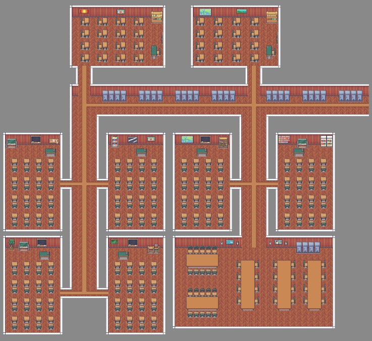

#Portfolio Periode 1.3 - Leon van der Sar
##Week 3
Deze week heb ik samen met Luuk en Eddy ervoor gezorgd dat Data is gekoppeld aan de GUI,hier kwam ik tijdens het werken er wel achter dat ik kan ook meteen moest zorgen dat er nieuwe leraren, studenten en klassen aangemaakt moesten worden.
Hier heb ik dus het grootste deel van de tijd aan gewerkt door af en toe nog een getter of setter toe te voegen aan de code.

Ook heb ik ervoor gezorgd dat er een nieuwe klasse is gemaakt voor het latewn verschijnen van een error zodat wanneer er niet aan een requirement werd voldaan dat het dan ook goed aangegeven werd.
Dit vond ik vooral handig om toe te voegen voor de rest van het proces sinds er soms fouten voor kunnen komen.

Deze week had ik dus vooral simpel werk gekregen en had ik er dus eigenlijk geen problemen mee sinds het simpele getters en setters zijn en af en toe een button toevoegen is.

##Week 4
Deze week ben ik vooral bezig geweest met het maken van de tiledmap sinds ik vooral nog moest wennen aan het programma tiled.
Ik ben aan het begin heel veel bezig geweest met het zoeken van een goede tileset en dit bleek een stuk moeilijker dan gedacht.
Ik had namelijk een paar requirements gezet:

- Het moet bij elkaar passen, anders is het niet mooi
- Er mag niet te veel detail in zitten.
- Er moet decor zijn zodat de klaslokalen niet te saai zijn.
- Het moet tafels hebben en een bord.

Na deze requirements gesteld te hebben begon ik dus met mijn zoektocht en kwam ik erg veel tegen ,maar de ene keer was er geen decor en de andere keer was was het niet mooi of paste het niet bij elkaar.
Maar na een paar uur zoeken kwam ik uiteindelijk bij een goede tileset die mij erg goed leek te zijn.

De tileset:
[Tilemap](https://limezu.itch.io/moderninteriors)

Deze tileset leek mij goed te voldoen aan de eisen, sinds het 16 bij 16 tiles heeft, het allemaal bij dezelfde tileset hoort en het heeft ook nog decor inclusief de tafels en het schoolbord.
Ik was hier erg blij mee en ik begon meteen met het maken van de map en uiteindelijk kwam ik met dit ontwerp:

De moeilijkheid van deze week was vooral het zoeken naar een goede tileset wat vrij lang duurde, maar daarnaast was het ook vooral de map maken sinds als ik een nieuw lokaal had gemaakt dat het dan ook echt goed lag, want als het ook maar 1 tile te ver lag dan kon ik niet alles 1 tile verplaatsen maar moet ik het handmatig allemaal goed zetten.
Dit vond ik erg vermoeiend en hierdoor duurde het ook erg lang naar mijn mening. Maar na al dat gedaan te hebben is het mij uiteindelijk goed gelukt een goede map te maken die er ook nog eens fatsoenlijk uit ziet.

##Week 5
Deze week ben ik aan de slag geweest met het verplaatsen van de camera en het zoomen van de camera. Hier moest ik even nadenken hoe ik het ging doen sinds ik niet precies meer wist hoe ik het best kon zoomen.

Na wat te hebben zitten testen heb ik een manier gevonden om in te kunnen zoomen. Dit is namelijk door de canvas te scalen. Dit kon ik doen door methodes te maken die kijken of er gescrolld wordt met de muis en nog een andere methode die dit doet maar dan voor het slepen van de muis.

Ik begon als eerste met het zoomen, hier was het vooral spelen met cijfers en het finetunen om ervoor te zorgen dat het werkte zoals het zou moeten werken.

Daarvan kwam dit eruit:

    double zoomFactor = 1.05;
    double deltaY = event.getDeltaY();
    
    if (deltaY < 0)
    {
        zoomFactor = 2.0 - zoomFactor;
    }

    if (!(node.getScaleY() * zoomFactor > 5) && !(node.getScaleY() * zoomFactor < 1))
    {
        node.setScaleX(node.getScaleX() * zoomFactor);
        node.setScaleY(node.getScaleY() * zoomFactor);
    }
    
Ik heb heel simpel gekeken naar wat het verschil is in de verandering van de muiswiel en dit geef ik mee aan deltaY, gaat de code verder en kijkt of deltaY negatief is of niet sinds als je naar een andere kant scrollt dat je niet wilt dat hij precies hetzelfde doet en zet hij hierbij dus de zoomfactor op 0.95 volgens de code hierboven
Hierdoor wordt de canvas verkleind en als de zoomfactor normaal 1.05 is dan wordt het dus steeds groter.

Om ervoor te zorgen dat er niet te ver in- en uitgezoomd kon worden heb ik een if statement neergezet die ervoor zorgt dat de canvas niet te groot of te klein wordt.
Als daaraan wordt voldaan dan wordt de canvas pas groter of kleiner gezet worden.

Waarom ik heb gekozen om dit in aparte methodes te zetten is omdat deze functies misschien ook ergens anderts nodig zijn en leek het mij handig om deze van tevoren deze apart te zetten. Ook is het vrij handig om zo weinig mogelijk code te hebben staan in de start methode zelf om het overzichtelijk te houden.