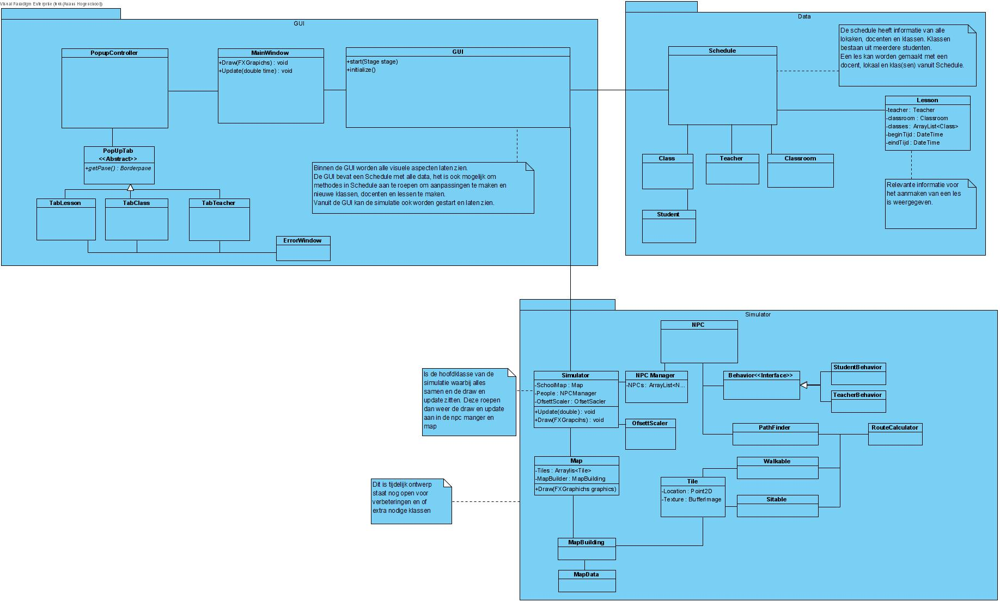
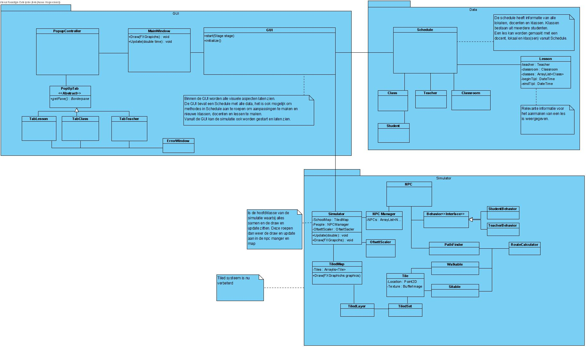
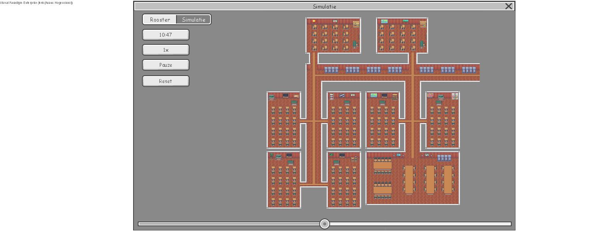
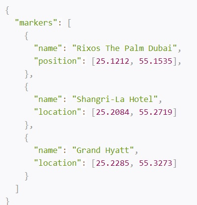
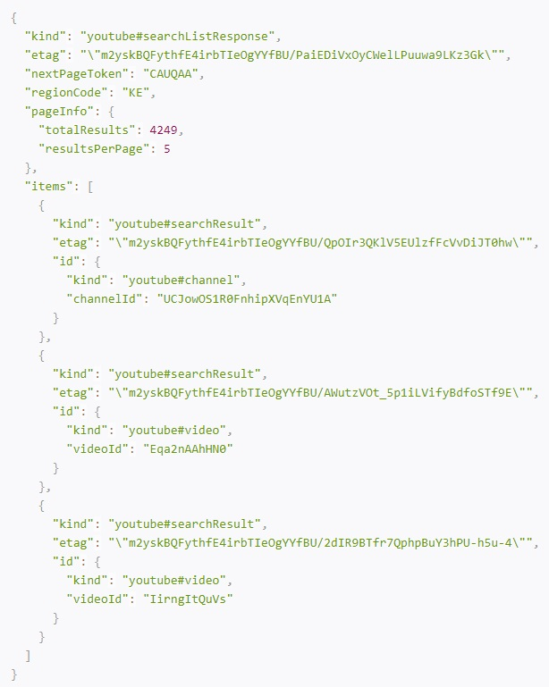
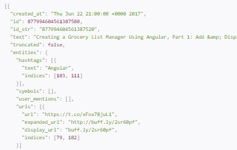

# Portefolio Luuk van Berkel 2169248

##Weekelijks log:
### week 3
Deze week heb ik samen met eddy en leon gewerkt aan het koppelen van gui. 
Hierbij moest de database worden gekoppeld aan de gui popupwindow. 
Deze is varandwoordelijk voor het wijzigen van de database. 

Problemen waarbij ik tegen aan liep was bijvoorbeeld de vbox met checkboxes. 
Ik heb daar een functie voor gemaakt die het aantal checkboxes tekenend aan 
de hand van de klasse in de database.
Deze methode is nog niet observable ik vindt het namelijk lastig 
om met observable te werken met de listview. 
Dit moet nog worden aangepast. Ik had eerst ook updat functies die 
alles deden syncen maar na refactoren waren deze niet meer nodig.

Code van de checkbox functie:

    public VBox selectClass(){
       VBox classselector = new VBox();
       classselector.setSpacing(5);
       classselector.setPrefHeight(110);
        for (String string : classes)
        {
            CheckBox box= new CheckBox(string);
            classselector.getChildren().addAll(box);
        }
        return classselector;
    }
    
    
###week 4
Deze week heb ik niet geprogrameerd maar gewerkt aan 
het ontwerp en het klasse diagram. Ook heb ik met leon 
samen gekeken hoe tiled werkt. Van deze week ben ik dus
 geen grote problemen tegen gekomen.
 
 Mischien was het beter geweest dat we dit hadden kunnen verdelen. Maar daar is het nu te laat voor.
 Ook is het diagram anders en is er niet of niet echt aan gehouden. Dit is ook jammer.
 
 Voor de volgende keer is het beter overleggen over het ontwerp. waardoor dit soor dingen iet meer kunnen gebeuren.
 
 
 
 ####Diagram:

###week 5
Deze week heb ik het ontwerp verbeterd en ben ik begonnen met een sprite klasse die de data van de klasse npc relayd en hem teken met de correcte orrienatatie. Hierbij vraag ik de richting op en kijk ik of het tussen bepaalde graades valt. Aan de handt hiervan bepaal ik de richting van de sprite. 

De loop animatie werkt nu ook goed. Hierbij update hij hem 
elke aantal pixels dat is afgelegd. Hierdoor ben je niet 
afhankelijk van de delatime. Maar zorgt er wel voor dat 
het gesynced er mee is.

Ook ben ik verder gegaan met het ontwerpen. 
Ik heb het klassediagram aangepast, ook was ik 
vergeten een wireframe diagram te maken. Deze heb 
ik nu ook gemaakt. Hier zijn de diagramen die ik gemaakt heb:

####Diagrammen:

De grootste problemen waar ik tegen aan liep was niet 
zo zeer het programmeren van mijn code maar het laten aansluiten 
van mijn code op de NPC klasse die Martijn had geschreven. Deze moest 
ik hiervoor namelijk tot de details begrijpen.

Nadat ik het begreep ging het vrij soepel met het maken 
van de npc sprite klasse. De functie die mij het meeste tijd
 kost was het animatie frame updaten.
 
 ####Code:

    /**
     * update methods
     */

    /**
     * this function is responsible for updating the frame of the npc while walking
     * @param x location x of the npc
     * @param y location y of the npc
     */
    public void locationUpdater(double x, double y){
        //updates while walking
        double xDif = x - this.previousX;
        double yDif = y - this.previousY;

        double distance = Math.sqrt(Math.pow(xDif, 2) + Math.pow(yDif, 2));

        if (distance >= refresh){

            if (frame < 5){
                frame++;
            } else {
                frame = 0;
            }
            previousX = x;
            previousY = y;
        }
    }

    /**
     * this function is responisble for updating the frame while rotating
     * @param rotation rotation of the npc
     */
    public void directionUpdater(double rotation){
        //updates while rotating on its place
        if (Math.abs(Math.toDegrees(previousROT - rotation)) >= 45)
        {
            if (frame < 5)
            {
                frame++;
            }
            else
            {
                frame = 0;
            }
            previousROT = rotation;
        }
    }

    /**
     * this function calculates the rotation of the sprite so the correct front is facing forward with the rotation
     * @param rotation rotation of the npc
     */
    public void calculateUpdater(double rotation){
        //loads the correct orientation

        double angleDegrees = Math.toDegrees(rotation);
        if ((angleDegrees<= 45 && angleDegrees>= 0) || (angleDegrees >= 315 && angleDegrees <= 180)){
            dir = 0;
        } else if (angleDegrees >45  && angleDegrees < 135){
            dir = 6;
        } else if (angleDegrees >= 135  && angleDegrees <= 225){
            dir = 12;
        } else if (angleDegrees > 225  && angleDegrees < 315){
            dir = 18;
        }
    }
}

###week 6
Deze week heb ik de npc sprite klasse van vorige week uitgebreid en aangepast ook heb ik behavior aan de npc toegevoegd als hij op locatie aan komt. Dit doet random bepalen. Ook heb ik de frames op een random punt te laten starten zodat een massa er natuurlijker uit ziet. Dit heb ik deze week aangepast aan de klasse NPC sprites er zijn nog andere verandering maar deze worden nog besproken in de andere alinea want deze waren noodzakelijk om de npc te laten zitten.

Ik ben ook samen bezig geweest om een loop te maken voor het spawnen en naar de lessen gaan. Deze is uiteindelijk niet gebruikt door ontbrekend functionaliteit

Naar mijn mening had er deze week meer moeten gebeuren maar ik had niet echt een taak deze week wat jammer was. Dit kan ik volgende week beter doen.

### week 7
Deze week ben ik begonnen aan het maken van de functie die er 
voor zorgt dat de npc worden aangroepen en naar de lokalen gaan 
en pauze houden. Ik moest dus eigenlijk de simulatie tot leven helpen. 
Dit heb  ik gedaan door nieuwe gedragsklase te schrijven en extra funties toe te voegen. 
De aula functie was namelijk nog niet geschreven. Ook moest ik functie bedenken 
die er voorzorgde dat er npc spawnen en verdwijnen deze heb ik in twee 
nieuwe klasse gezet, dit zijn grote algoritme die veel data nodig hebbben 
en daaruit bepalen of de npc moeten spawnen naar welk lokaal ze moeten 
op welke zitje ze gaan zitten en zo voorts. Dit is wat deze code doet.

Problemen waarbij ik hier tegen aanliep was het vinden van de seats hiervoor heb ik een algorime bedacht samen met martijn
Wij hebben hiervoor gekozen om de area te gebruiken in in onze json file hierbij zoekt hij in een specfieke area voor de seats. 

####Code:

    /**
     * Searches for seats in a rectangle part of tiles marked as being in the area for classrooms
     * Starts looking at the given row and column, searches each row untill the end of the area is reached
     * Stops when on a new row the tile is no longer part of the area
     * @param rowFrom
     * @param columnFrom
     * @return
     */

    public ArrayList<Seat> collectSeats(int rowFrom, int columnFrom){
        ArrayList<Seat> seats = new ArrayList<>();
        TiledMap tiledMap = Simulator.getTiledmap();

        Tile start = Simulator.getTiledmap().getAreaLayer().getTile(rowFrom, columnFrom);
        if (start != null)
        {
            // position keeps track of the position of tiles to check
            Point2D position = new Point2D.Double(start.getX(), start.getY());

            boolean running = true;
            while (running)
            {
                // check for the row of the current tile all subsequent tiles untill a tile was found which is not walkable
                if (tiledMap.isPartOfArea(position))
                {
                    if (tiledMap.isSitableTile(position))
                    {
                        Tile selected = tiledMap.getSeatableLayer().getTile(position);
                        if (selected != null)
                        {
                            // if the tile is walkable, seatable and exists in the seatablelayer then add a new seat at that tile position
                            seats.add(new Seat(new Point2D.Double(selected.getX() + 8, selected.getY()), null, selected.getRotation()));
                        }
                    }
                    position.setLocation(position.getX() + tiledMap.getTileWidth(), position.getY());

                }
                else
                {
                    // go to a row lower
                    position.setLocation(start.getX(), position.getY() + tiledMap.getTileHeight());
                    // if the tile on the lower row is not walkable, then the classroom is finished so stop looking for seats
                    if (!tiledMap.isPartOfArea(position))
                    {
                        running = false;
                    }
                }
            }

        } else {
            System.out.println("Collecting seats, starting tile was null");
        }

        return seats;
    }

###week 8 
Deze week ben ik verder gegaan aan het werk van week 7 dat was dus het implementeren van
de funties van de simulatie die verantwoordelijk waren voor het gedrage en locatie.

Problemen waarbij ik hier tegenaan liep was 
bijvoorbeeld het maken van het algoritme dat kijkt
wanneer wat gebeurt. Hiervoor heb ik gekozen om per 
les de npc aan te sturen, dit had ook per npc gekunt
of anders, maar dit was makkelijker omdat bij ons 
lesson op de top level van onze hierachie staat.
Dit maakt het makkelijk om daar in te zoeken.

De parameters die nodig zijn om de npc aan te sturen zijn lessen die nu gaan gebeuren, de locatiemanager voor de stoelen
aan te sturen en de npcmanager voor despawnen en spawnen. En het schedule om te checken op toekomstige lessen voor despawning.

De functie is nog niet gerefactord deze week dat moet nog gebeuren.

  
####Functie voor students:
    public void update(ArrayList<Lesson> lessons, LocationManager locationManager, NPCManager npcManager, Schedule schedule){

        //de-spawning logic
        ArrayList<Lesson> lessonsAllday = schedule.getLessonArrayList();

        for (NPC npc: npcStudentsOnScreen) {
        
            //if not found then despawn npc boolean is true
            if (!skippable.contains(npc)){
            
                //checks if there are still lessons
                boolean stillLesson = true;
                
                //loop from hell that checks to dispawn
                for (Lesson lesson : lessonsAllday) {
                    for (Group group : lesson.getGroups()) {
                        for (Student student : group.getStudents()) {
                            if (student == npc.getPerson()) {
                                if (!lessonsPassed.contains(lesson) && lessons.contains(lesson)) {
                                    stillLesson = false;
                                }
                            }
                        }
                    }
                }

                //if there are non the de-spawn is initiated
                if (stillLesson) {
                    System.out.println(npc.getPerson().getName() + "Is going to be removed");
                    locationManager.scriptedEndLesson(npc);
                    npc.resetDestination();
                    npc.getCurrentPathfinding().setDestination(1425, 725);
                    npc.setCollisionEnabler(false);
                    skippable.add(npc);
                }
            }
        }

        //lesssons change and spawn logic
        for (Lesson lesson : lessons)
            if (!lessonsPassed.contains(lesson))
            {
                // for the students
                ArrayList<Group> groups = lesson.getGroups();
                for (Group group : groups)
                {
                    ArrayList<Student> students = group.getStudents();
                    for (Student student : students)
                    {

                        //if the npc existed lesson change will be iniated
                        if (npcStudentsOnScreen.contains(new NPC(student)))
                        {
                            System.out.println(student.getName() + ": Student word van huidige locatie naar nieuwe les verplaatst");
                            for (NPC npc : npcStudentsOnScreen)
                            {
                                if (npc.getPerson().equals(student))
                                {
                                    for (int i = 0; i < inAula.size(); i++) {
                                        if (inAula.get(i).getPerson() == student){
                                            inAula.remove(i);
                                        }
                                    }
                                    locationManager.scriptedEndLesson(npc);
                                    npc.resetDestination();
                                    npc.getCurrentPathfinding().setDestination((int)
                                            lesson.getClassroom().getEntry().getX(), (int)
                                            lesson.getClassroom().getEntry().getY());
                                }
                            }
                        }

                        //else there will spawn a new npc
                        else
                        {
                            System.out.println(student.getName() + ": de student komt de school binnen en gaat naar zijn les");
                            NPC npc = new NPC(student);
                            Pathfinding pathfinding = new Pathfinding(tiledmap/*GUI.getWalkablemap()*/);
                            npc.setPathfinding(pathfinding);
                            pathfinding.addNpc(npc);
                            npc.setCollisionEnabler(true);
                            npcStudentsOnScreen.add(npc);

                            if (pathfinding.getExactDestination() == null)
                            {
                                pathfinding.setDestination((int) lesson.getClassroom().getEntry().getX(), (int) lesson.getClassroom().getEntry().getY());
                            }
                            npcManager.addNPC(npc);
                        }
                    }
                }
                //add lesson in list of passed ones
                lessonsPassed.add(lesson);
            }

        //used list
        ArrayList<NPC> used = new ArrayList<>();

        //checks if npc is used else it is send to the auditorium
        for (Lesson lesson : lessons) {
            for (Group group : lesson.getGroups()){
                for (Person person : group.getStudents()){
                    for (NPC npc : npcStudentsOnScreen){
                        if (npc.getPerson() == person){
                            used.add(npc);
                        }
                    }
                }
            }
        }

        //sends to auditorium
        for (int i = 0; i < npcStudentsOnScreen.size(); i++)
        {
            boolean ofscreen = true;
            for (int j = 0; j < used.size(); j++)
            {
                if (used.get(j) == npcStudentsOnScreen.get(i))
                {
                    ofscreen = false;
                }
            }
            for (int j = 0; j < inAula.size(); j++) {
                if (inAula.get(j) == npcStudentsOnScreen.get(i)){
                    ofscreen = false;
                }
            }
            for (int j = 0; j < skippable.size(); j++) {
                if (skippable.get(j) == npcStudentsOnScreen.get(i)){
                    ofscreen = false;
                }
            }

            if (ofscreen)
            {
                locationManager.scriptedEndLesson(npcStudentsOnScreen.get(i));
                npcStudentsOnScreen.get(i).resetDestination();
                npcStudentsOnScreen.get(i).setCollisionEnabler(false);
                npcStudentsOnScreen.get(i).getCurrentPathfinding().setDestination((int) AuditoriumBehavior.entry.getX(), (int) AuditoriumBehavior.entry.getY());
                inAula.add(npcStudentsOnScreen.get(i));

            }
        }
    }
    

##Onderzoek naar simulaties in het bedrijfsleven

De stelling is:	“In het bedrijfsleven wordt steeds meer in software gesimuleerd”.

Ik heb deze stelling gekozen omdat wij nu ook bezig zijn met een simulatie dus dat leek mij het leukste.
De andere stelling ging over het gebruik van javaFX in het bedrijfsleven.

###Mijn voorspeling
_______________________________________
Ik denk dat het het steeds groter gaat worden bij bedrijven omdat er niet iets gebouwd hoeft te worden maar alleen in software hoeft te worden geschreven.
Dit zorgt voor koste reductie omdat het product minder vaak gemaakt te worden. Ook kost het zo minder tijd.

Het wordt ook steeds betaalbaarder om grote simulaties te runnen op computers en servers. De hardware prijs van servers is omlaag gegaan in vergelijking met een paar jaar geleden. 
Nu is het een klein beetje anders door corona en de chip te korten, maar het is nog beter dan vroeger. 

Al deze punten die hier boven zijn genoemd wijzen er op dat er een groei zit in het gebruik van simulatie software. 

###Onderzoek
__________________________________________________
####Groei van de simulatie markt:

#####Marktanalyse:
Volgens verschilende markt analysten zit er een groei in de market van simulatie software en zijn omzet. Dit wil zeggen dat het meer gebruikt gaat worden, 
In dit toekomst door bedrijven, dit is natuurlijk wel een voorspelling maar het zegt veel voor de toekomst.

####Oorzaak van de groei:

#####Waarom groei:
Veel bedrijven hebben een prototype digitaal gemaakt voor dat het eerst gebouwd wordt, dit komt volgens het artikel "Computer Simulations Are Better — and More Affordable — than Ever"
door dat het de product ontwikkeling versnelt omdat je het eerst digitaal kan maken, ook wordt volgens die artikel het digtaal steeds realistischer.

#####Vroegere simulaties:
Simulaties werden vroeger ook veel gebruikt maar het was toen lastiger om ze te gebruiken. Dit ligt nu anders omdat het nu makkelijker is het graphische te weergeven. Dit maakt het makkelijker om deze tools te gebruiken. 
Bijvoorbeeld zegt het artikel dat het in 1997 tweeendertig milioen euro zou kosten om een simulatie machine te krijgen die ongeveer even krachtig is als een smartphone vandaag.
De kosten zijn dus  ook heel erg omlaag. 

#####Gebruik van CAD:
Bedrijven hebben lang gebruik gemaakt van computer-aided design (CAD) software 
om hun producten te maken, maar deze software is steed makkelijker te gebruiken en aan te
komen. Ook is de software meer acuraat en kan er meer mee worden gedaan een voorbeeld heirvan is simulaties maken. Dit reduceerd kosten ook voor kleinere bedrijven.
Een voorbeeld van een makkelijker en goedkoop cad software is solidworks. Hierin kan worden ontworpen maar ook worden getest of het ontwerp daadwerkelijk werkt met simulaties.

#####Ontwerpen en maken:
Door deze software kan er ook makkelijkere samengewerkt worden tussen ontwerpen en het maken van het product. De ontwerpen kunnen bijvoorbeeld al geworden gesimuleerd.
Dit zorgt voor een reductie in tijden kosten om te kijken of een ontwerp bijvoorbeeld wel haalbaar kan worden.

####Conclusie:
Deze reden zorgen voor een groei in het gebruikt van simulatie software. Dit zorgt voor een veel gebruik in bedrijven. Dit komt voor een groot gedeelte door meer cad software met simulatie funties.

###Reflectie
_______________________________________
Ik was vrij correct met mijn voorspelling voor het het onderzoek en de stelling is dus waar dat er veel simulatie sofware wordt gebruikt. Sterker nog het is een groeide markt.
Wat ik minder heb benoemd is het verbeteren met cad software om simulaties te gebruiken wat een van de belangrijkste factoren is.

##Gebruik van JSON in applicaties
In deze opdracht was het de bedoeling dat er een lijst van applicatie komt die allemaal json gebruiken. Deze lijst moet ook bevatten waarom ze het gebruiken.

### Wat is JSON:
___________________________

JSON is oorspronkelijk ontstaan uit de programmeertaal JavaScript, 
Het is niet afhanklijk van javascript het is een taalonafhankelijk dataformaat. 
Code voor het lezen en maken van JSON-data is beschikbaar in een 
grote diversiteit van programmeertalen dit maakt het veel gebruikt. 
JSON wordt ook veel gebruikt om data te versturen en
 ontvangen vanuit een webgebaseerde API.

####Structuur voorbeeld:
In JSON worden uitsluitend de volgende constructies gebruikt:

getallen: 3.15
strings: "dit is een string"
de letterlijke waardes true, false en null
array-initialisers: [ waarde , ... ]
object-initialisers: { string : waarde , ... }
Het onderstaande voorbeeld is de JSON-weergave van een lijst met twee elementen. Beide elementen zijn zelf een object met weer een diepere structuur.

Geciteerd voorbeeld van: wiki/JSON

####Aplicaties:

#####Google Maps:
Google maps maakt gebruik van json files om markers op te slaan. Google maps API gebruikt namelijk json voor veel dingen. De manier waarop de markers in de api van google maps worden opgeslagen als json is als volgende:

#####Youtube:
Ook youtube maakt gebruik van json files om data terug te geven. Json wordt namelijk gebruikt in de Youtube search API. Een voorbeeld van dat die youtube terug geeft zijn search results:

#####Twitter:
Twitter maakt gebruik van een rest api die ook json files gebruikt. Daarom wordt er json in twitter gebruikt. Een voorbeeld hier van is:

#####Conclusie
JSON wordt dus in veel applicaties gebruikt om data op te slaan. Dit komt waarschijnelijk door het wijde gebruik van dit type.

##Bronnen:
- Computer Simulations Are Better — and More Affordable — than Ever ( Willy C. Shih) - Geschreven op: Harvard Business Review - Bron: https://hbr.org/2020/10/computer-simulations-are-better-and-more-affordable-than-ever
- Simulation Software Market Outlook: 2025 - Geschreven op: alliedmarketresearch - Bron: https://www.alliedmarketresearch.com/simulation-and-analysis-software-market
- JSON - Geschreven op: https://nl.wikipedia.org/wiki/JSON
- 10 JSON Examples to Use in Your Projects - Geschreven op: SitePoint - Bron: https://www.sitepoint.com/10-example-json-files/

    

