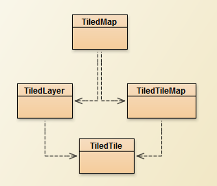
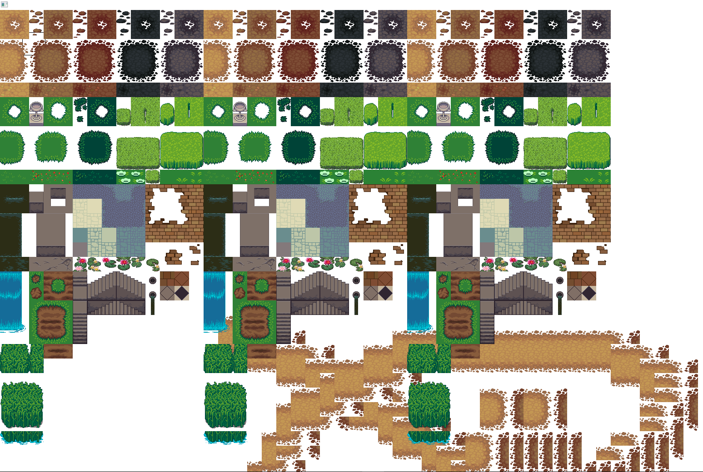
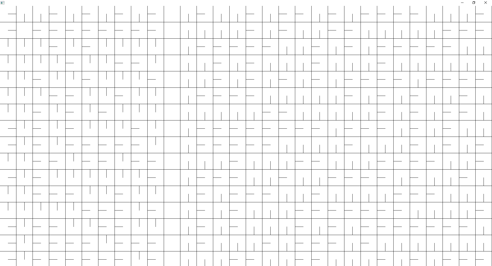

# Portfolio Martijn de Kam schoolplanner project
## Week 3
Deze week werk ik met Ewout aan het mogelijk maken om wijzigingen te maken in het rooster.

Iets dat al snel bleek was dat er aardig wat overlap was met wat de anderen gingen doen en dat we dat allemaal tegelijkertijd gingen doen.
Dit zorgde voor wat moeizaamheden tijdens het werken.

Zelf ben ik individueel doorgegaan, maar Ewout is na een tijdje samen met de anderen gaan zitten werken.

Tijdens het programmeren ben ik verder niet echt tegen problemen aangelopen.
Ik had echter wel een ernstige migraine op de donderdag waardoor ik aan het einde van de middag echt moest stoppen.
De dag daarna op vrijdag was ik ook nauwelijks in staat om ook maar iets te doen.
Ik heb een paar bugs opgelost die de anderen hadden aangegeven, verder heb ik niet veel kunnen doen.

## Week 4

In week vier ben ik gaan werken met het inladen en tekenen van de tiledmaps. Deze twee punten heb ik ook opgesplitst, door eerst te zorgen dat alles kan inladen en daarna pas te gaan kijken naar het tekenen.

### Ontwerp

Hiervoor heb ik de powerpoints van het opstart college erbij gepakt, hierin stonden een aantal punten over de structuur waarin dit kan en wat er moet gebeuren.

Verder heb ik Tiled erbij gepakt en een willekeurige tiledmap gemaakt met verschillende layers om te gebruiken om mee te testen.

Voor het werken heb ik in de simulatie package een nieuwe package bijgemaakt met daarin alles over de tiledmaps met ook een uitvoerbare Main klasse om puur deze functionaliteiten te testen los van de andere code.

Om te kijken wat er nodig was qua code heb ik uit Tiled het bestand geëxporteerd als Json en daarin gekeken wat voor objecten en attribuuten er allemaal nodig zijn. Tijdens het kijken hiernaar heb ik ook opgemerkt dat dit heel erg in lijn is met wat er in de powerpoints staat over de structuur.

### Implementatie tiledmaps inladen

Na kijken naar het ontwerp en hoe ik dit wil gaan aanpakken ben ik gaan implementeren van de code. Hierbij ben ik tegen een paar punten aangelopen.

Met het programmeren van de data inlezen uit het Json bestand ben ik tegen twee problemen opgelopen:

- Met het lezen van het json bestand zelf kreeg ik een nullpointer exception.

Dit heb ik opgelost door eerst te kijken of de filepath string wel mee werd gegeven, dus het was niet dat er helemaal niets binnenkomt. 
Het volgende vermoeden is dat de filepath niet is herkend, om dit te testen heb ik de string een aantal keer aangepast en getest. 
Uiteindelijk heb ik de relative path copy gebruikt, deze werkte ook nog net niet, maar door een / ervoor te zetten werkte het wel.

- Tijdens het lezen van de array met tilesets kreeg ik een nullpointer exception bij het uitlezen van een specifieke waarde.

Met debuggen doormiddel van een paar breakpoints heb ik gevonden dat omdat een van de tilesets alleen "firstgid" en "source" als waardes heeft een nullpointer geeft wanneer bijvoorbeeld de "columns" wordt gevraagd.
Als oplossing heb ik de constructor een nullpointerexception laten throwen en bij het uitlezen van de array in een for loop een try catch gezet waarbij de tiledset alleen wordt toegevoegd als er geen nullpointer komt.

Uiteindelijk is het wel gelukt om de TiledMap in te lezen met correcte waardes.

### Tiledmaps tekenen

Met de ingeladen bestanden ben ik gaan kijken hoe ik het kon tekenen. Dit was echter heel simpel te doen met wat modulo en deel rekenen om de x en y positie te bepalen.
Verder ben ik niet tegen grote problemen aangelopen hier.

Bij de senior begeleiding heb ik wel wat feedback hierover gekregen. Namelijk dat in plaats van 1 afhalen van de data gid uit de tiledlayer, dat ik er de firstgid van de tiledset uit moet halen. Voor de eerste tiledset is het hetzelfde maar vanaf de tweede moet het op deze manier.

Verder was er ook laten zien dat het mogelijk is om op een grote afbeelding veel kleine afbeeldingen te plakken in plaats van die allemaal individueel naar het scherm te tekenen. Dit zou efficiënter kunnen zijn, maar dat was niet helemaal zeker.

### Tile rotatites herkenen

Verder ben ik ook gaan kijken of het mogelijk is om geroteerde tiles te herkennen en tekenen naar vraag van degene die het ontwerp van de simulatie maakt.

Problemen die ik daarbij ben tegengekomen zijn:

Met het lezen van geroteerde tiles, tegen het probleem aangekomen dat tijdens het lezen met de JsonReader de int waardes een overflow gaven (bij grote getallen werden deze negatief).

Het printen van de uitgelezen waardes bevestigd dat de getallen negatief zijn
Kijkend naar de getallen in Json en een google search geeft dat de getallen groter dan de int limiet zijn, namelijk groter dan 2,15 miljard.

Dus in plaats van lezen als een int moeten de getallen op een andere manier worden ingelezen.
Bij de jsonarray waaruit wordt gelezen zit een methode om als een jsonNumber te lezen, hiermee testen geeft dat dit de goede volledige decimale getallen geeft.
Van de jsonnumber kan ook de long value worden gepakt om in een data lijst te zetten.
Testen van de waardes geeft dat deze manier werkt!

Nu met het detecteren van de rotatie doormiddel van bit rekenen kan het programma alle geroteerde getallen zien

Uiteindelijke oplossing was dus het omzetten van de code van:
~~~
for (int i = 0; i < jsonArraySize; i++) {
    this.data.add(jsonArray.getInt(i));
}
~~~
Naar:
~~~
for (int i = 0; i < jsonArraySize; i++) {
    this.data.add(jsonArray.getJsonNumber(i).longValue());
}
~~~
Samen met het omzetten van de data ArrayList, van een Integer lijst naar een Long lijst.

### tile rotaties tekenen

Een paar dagen later ben ik verder gaan kijken naar het tekenen van de geroteerde tiles.

Tijdens dit implementeren is opgevallen dat er twee rotaties mogelijk waren die ik hiervoor nog niet had gezien.
Namelijk een gespiegelde tile (horizontaal of verticaal gespiegeld) roteren links of rechtsom. Dit is nu wel toegevoegd.

Verder is dit onderdeel goed gegaan. Ik heb in een ander project met een simpele afbeelding getest hoe het roteren en spiegelen kan werken met de affinetransform en daarbij gekeken naar hoe het tekenen daarbij moet compenseren in de translatie.
Met die informatie ben ik begonnen met het daadwerkelijke project om daar het tekenen te implementeren, waarbij er nu aan de hand van de gedecteerde rotatie op de affinetransform rotaties, schalingen en translaties worden gemaakt om de tiles goed weer te geven.

Tijdens het implementeren ben ik tegen twee dingen aangelopen.

Een is dat in de tiledmap de tiledset niet altijd goed wordt meegegeven, door een beetje door de GUI knoppen van Tiled te spitten en proberen ben ik erachter gekomen dat de tiledset moet worden geëmbed in de tiledmap, anders wordt het niet meegenomen in de json.

Het tweede waar ik tegen aan ben gelopen is dat na de export naar json en het plakken in intelliJ de jsonreader het json bestand niet herkent, na meerdere malen nieuwe exports te proberen, de file directory aan te passen en de bestandsnaam aan te passen ben ik naar een vermoeden gekomen van het probleem.
Namelijk wanneer ik de bestandsnaam refactor werkt het laden wel en wanneer ik het nog een keer refactor naar het origineel werkt het nog steeds. Dus ik denk dat er iets mis gaat met het overzetten naar intelliJ. 
Hier ga ik bij de senior begeleiding over vragen of de senior een antwoord weet.

Bij de senior begeleiding wist de senior niet wat het probleem zou kunnen zijn.
Daarbij had ik ook live tijdens de begeleiding een nieuw json bestand in het project gezet en die geprobeerd te laden, naar dat werkte wel in een keer.
Dus ik weet niet zo goed meer wat het probleem was. Maar zolang het werkt voor het project is het zo goed.

## Week 5

In week 5 ben ik aan de slag gegaan met de NPC logica.

### Aanpak en ontwerp

Hiervoor heb ik een NPC klasse aangemaakt en een NPCManager klasse die de NPCs beheert en kan updaten en tekenen.

Verder heb ik om de functionaliteiten te testen een uitvoerbare klasse gemaakt: NPCTester, die de NPCs als simpele rechthoeken kan tekenen om het bewegen te laten zien.

### Implementatie basis logica

Tijdens de implementatie ben ik niet tegen grote problemen of beslissingsmomenten gekomen.
Het is allemaal redelijk recht aan direct dingen implementeren van wat ik al weet van ogp of 2dgraphics.

De punten die ik heb geimplementeerd zijn:

- Een NPC heeft wat simpele data, hierbij is het vooral belangrijk dat een NPC altijd een persoon is en daarop geïdentificeerd wordt.

- Een NPC kan bewegen doormiddel van een x en y snelheid attribuut en een x en y positie. Waarbij met de deltaTime van de update de speed waardes bij de desbetreffende positie waardes worden opgeteld met de deltaTime vermenigvuldigd.

- Een NPC kan collision zien met andere npcs, waarbij de npcs dan niet verder kunnen bewegen. Dit wordt gedaan door alle andere NPCs na te gaan. Dit is een prima oplossing voor kleine aantallen npcs, maar voor grotere aantallen moet er een efficiëntere methode komen (honderden of duizenden).

- Een NPC kan naar een bepaald punt worden gestuurd, waarbij die dan in een rechte lijn daarnaartoe loopt. Dit wordt gedaan door te kijken wat de verhouding is van de x en y afstand van de totale afstand, zodat de snelheden afgesteld zijn op elkaar om in de goede richting te gaan.

### Rotatie logica NPC

Een paar dagen later ben ik verdergegaan met de NPC logica en heb daarvoor de rotatie geïmplementeerd.
Hierbij waren de doelen het mogelijk maken om een NPC naar een bepaalde richting te laten draaien en voor de NPC om naar een bepaalde positie te wijzen waarbij die eerst draait en dan in de goede richting gaat lopen rechtvooruit.

In eerste instantie had ik de rotatie in graden gezet (0 tot 360), maar al snel ben ik overgestapt naar radialen (0 naar 2 PI) omdat veel methodes radialen gebruiken en het dan makkelijker is om het zo direct te doen.

Verder heb ik er ook voor gekozen om het oude systeem die met een xspeed en yspeed naar een punt toe gaat in de code te laten samen met het systeem voor het bewegen met de rotatie.
Hiervoor heb ik gekozen omdat we volgende week met pathfinding gaan werken en het goed kan zijn dat het oude systeem daar veel makkelijker op werkt dan met de rotaties, of dat een combinatie van beide beter is. Dus voor nu erin laten en later kijken wat beter is.

Omdat ik de verschillende systemen heb behouden heb ik ervoor gekozen om de verschillende onderdelen van de update methode te scheiden van elkaar in prive methodes.
Dit zijn dan een update om te checken of de NPC op de bestemming is, of de NPC collision heeft met andere NPCs, en natuurlijk de verschillende methodes voor xyupdate en rotatieupdate.
Dit geeft wat meer structuur, waarbij alleen een methode in comments hoeft worden gezet, in plaats van een heel blok code.

Om te zorgen dat de NPC ook stopt bij de bestemming zijn alle bewegingsupdates nu binnen een if statement die kijkt of de NPC al op de bestemming zit. 
Bij de destinationupdate veranderd de boolean naar true wanneer de NPC op de besttemming zit en bij het veranderen van de destination staat die op false.

Verder ziet het eruit na het testen dat de rotatie goed werkt. De npc draait een stukje naar de goede richting en gaat dan rechtstreeks naar een gekozen punt.

## Week 6

In week 6 ben ik gaan werken aan een bugfix voor de npc collision (dit gaat nog niet helemaal goed) en de pathfinding voor npcs

### Npc collision bugfix

In sommige situaties clippen de npcs in elkaar en gaan met een hogere snelheid samen naar een andere richting toe.
Dus er gaat iets mis met de collision bounds en ook iets mis met het terugzetten van de npc.

Voor de collision bounds werden eerst de 4 hoeken van de hitbox van de huidige npc gepakt en het vierkant van de hitbox van een andere npc en gekeken of een van de vier hoeken in de andere npc zat. Het blijkt dat dit niet zo goed werkt.
Als mogelijke oplossing dacht ik om in plaats van vier verschillende hoeken te pakken simpelweg het vierkant van de hitbox te kijken en of er overlap is met het vierkant van de hitbox van andere npcs.

Voor het terugzetten van de npc wanneer een verdere beweging een collision zou hebben werd er eerst handmatig de x en y veranderd. Maar dit was dus niet op een goede manier.
In plaats van gecompliceerd verder te gaan doen heb ik de methode die de verplaatsing regelt aangeroepen met de negatieve van deltaTime, om dan dezelfde verplaatsing in de andere richting te krijgen.

Met deze twee veranderingen was het probleem opgelost en stoppen de npcs nu wanneer ze botsen met andere npcs.

### Pathfinding

Naast de bugfix ben ik ook begonnen aan de pathfinding. 
Tijdens het opstartcollege hadden we een demonstratie gekregen van hoe we pathfinding konden implementeren. 
Echter heb ik pathfinding al geïmplementeerd voor mijn 2Dgraphics eindopdracht waardoor het niet nieuwe principes zijn.
Daarom ben ik dus begonnen met in principe pathfinding op dezelfde manier te implementeren als bij mijn particle flow simulatie eindopdracht voor 2Dgraphics.

Er zit wel een redelijk groot verschil tussen de pathfinding voor de proftaak en die ik al ken.
Namelijk dat je per tile die je checkt niet alleen de afstand wil weten die die moet verlopen, maar je wilt juist weten in welke richting je moet gaan om naar de bestemming te gaan.
Hierdoor moest ik het algoritme net iets aanpassen. 
Waarbij de tiles ook een bestemming attribuut hebben die een waarde van een enumerator hebben, UP, LEFT, RIGHT, DOWN of NONE. 
Dit geeft heel simpel aan welke richting een tile naar moet wijzen.

Het algoritme werkt als volgt:
- Een tile is de bestemming.
- De bestemming wordt gezet als originele tile.
- Vanuit de originele tile wordt gekeken naar welke tiles direct aanliggend zijn (boven, links, rechts, onder).
- Voor elke tile wordt gekeken of ze binnen de map vallen en of ze loopbaar zijn.
- Wanneer bovenstaande klopt dan wordt op de tile een richting aangegeven naar de originele tile.
- De geldige tiles van stap 3 worden toegevoegd aan een lijst met tiles die in de volgende loop iteratie moeten worden gecheckt.
- De originele tile van stap 2 wordt toegevoegd aan een lijst met tiles die al zijn gecheckt. Deze mogen ook niet meetellen vanaf stap 4 samen met de tiles buiten de map en niet loopbare.
- De vorige stappen worden herhaalt met het lijstje van tiles die opnieuw worden gechekt, waarbij wanneer dat lijstje af is het nieuwe lijstje met tiles die daar weer van aanliggend zijn worden gechekt, enzovoorts.

Behalve het stukje met de richting werkt het algoritme in principe precies hetzelfde als wat ik voor 2Dgraphics heb gemaakt, waardoor het geen grote uitdaging was.

Om te testen of het algoritme goed werkt heb ik een debug draw methode toegevoegd die ook lijntjes tekent in de richting van waar npcs naartoe zouden moeten lopen.
Dit is te zien in de afbeelding hieronder:

(Wanneer de afbeelding op een te klein stuk scherm wordt gezet wordt de afbeelding niet goed laten zien, lijnen vallen weg, kleuren vervagen, etc.)

In de afbeelding is helemaal links boven een leeg vakje te zien, dit is de bestemming. 
Alle andere vakjes wijzen naar een route richting dat vakje. 
De enige vakjes die er niet naar wijzen zijn een reeks vakjes richting het midden van de afbeelding. 
Dit zijn niet loopbare tiles, waarbij het ook te zien is dat het pad eromheen loopt.
De bestemming en de niet loopbare tiles hebben allebei geen bestemming waardoor ze allebei leeg zijn. 

Wanneer een tile twee even lange mogelijke paden heeft naar de bestemming wordt arbitrair tussen die twee gekozen.
Degene die het eerste wordt gecheckt in de loop die wint en aangezien een hashset wordt gebruikt kan dit redelijk wisselen.
Maar dit is nog steeds het kortste pad naar de bestemming en dat het niet consequent is in de beslissing maakt voor deze implementatie niet uit.
Het is juist net wat leuker dat er wat willekeurigheid in de paden zit voor de npcs, mensen zijn ook niet voorspelbaar.

Npcs kijken naar op welke tile ze staan en naar welke richting ze dan moeten lopen.
Wanneer ze in de bestemming tile zijn stoppen ze met de tile richting volgen, maar gaan ze naar de specifieke x,y postiie van de bestemming binnen die tile.
Verder gebeurt het wel dat npcs precies op de randjes van tiles gaan lopen. Dit moet nog worden aangepast voor wanneer ze op de volledige tiledmap gaan lopen en niet in de muren mogen lopen.

### Overige punten

Ik ben verder nog tegen een probleem gelopen tijdens het werken.
Namelijk dat npcs soms wanneer ze naar een punt toe moeten lopen het punt maar net missen.

Na een beetje testen en kijken naar de code blijk dit probleem te komen doordat wanneer npcs naar een punt toe moeten lopen ze vanuit het linksbovenste hoekje van de hitbox direct naar het punt worden gestuurd.
Maar de check of ze op het punt zijn gebeurt binnen de gehele hitbox.
Waardoor wanneer er net wat kleine afronding foutjes zijn bij het berekenen de bestemming niet exact wordt bereikt.

Als oplossing voor dit probleem heb ik de hitbox behouden zoals het is, maar de berekening van het lopen aangepast.
In plaats van vanuit het links bovenste hoekje te kijken is het veel beter om te kijken vanuit het middelpunt van de hitbox.
Hierdoor kunnen kleine afrondingsfoutjes worden opgevangen doordat er meer marge voor fout is.

Deze verandering heeft het probleem opgelost waardoor npcs nu altijd hun bestemming herkennen.

## Week 7

In deze week zijn er geen nieuwe dingen die bijkomen aan het project.
Het is alleen verbeteringen maken op wat al is gemaakt en losse onderdelen samenvoegen.

Omdat we op het laatste stuk van het project zitten hebben we gezegd dat het erg belangrijk is om doelgericht te gaan testen op alle gëeisde functionaliteiten.
Daarom hebben we besloten dat een persoon (ik) een dag na het werk van de rest van de groep alles gaat testen op de requirements en nodige aanpassingen gaat maken op dingen die niet goed werken.

Voor dit testen gebruik ik de lijst met requirements die in de periodewijzer staat.
Ik ga elke individuele requirement na, kijk of het voldoet aan de eisen en mocht dat niet zijn of niet volledig dan noteer ik waarom niet.
Dan na de hele lijst na te gaan ga ik de tekortkomingspunten een voor een na en ga die proberen op te lossen.

### bugs fixen

Ik ben een lijst met gevonden bugs nagegaan waar ik zo veel mogelijk kritische bugs heb opgelost en missende functionaliteiten heb toegevoegd.

Over het algemeen ging dit redelijk soepel.
De meeste bugs waren recht toe rechtaan het probleem opzoeken, gemakkelijk kunnen zien wat het probleem was en hoe het kon worden opgelost en die oplossing toepassen.

Er was alleen een bug waar ik net wat meer moeite mee had.
Namelijk dat de npcs compleet niet wouden inladen.

Met een beetje zoeken naar waar npcs worden aangemaakt en hoe ze worden getekend ben ik erachter gekomen dat er een exception wordt gethrowed waardoor de code nooit het gedeelte bereikt waarbij de npcs worden toegevoegd aan de lijst met npcs om te gaan tekenen.
Het stukje code dat de exception veroorzaakt in comments zetten bevestigd dit.

Deze code gaat om het identificeren van zitplekken in lokalen, waar de npcs en docenten dan op kunnen zitten.
Er worden te weinig zitplekken geïdentificeerd, waardoor er een indexOutOfBounds exception ontstaat.

Een snelle "oplossing" zou een try catch neerzetten zijn, maar uiteindelijk zijn die zitplaatsen ook nodig en de tijd zit nog niet krap genoeg om daar prioriteiten in te stellen, dus pak ik het achterliggende probleem aan.

Het identificeren om te stoppen met zoeken naar zitplaatsen gebeurt door te kijken of een volgende tile op de map niet meer binnen een "area" van lokalen valt.
Maar dit gebeurt dus te vroegtijdig.

Het inspecteren van de code die er staat geeft geen duidelijke oorzaken van het problemen.
Wat kleine punten aanpassen die het misschien zouden kunnen veroorzaken lost het niet op.
Na een tijdje blijven kijken is mijn vermoedden meer gegaan richting de manier waarop wordt gezien of een punt binnen de "area" valt.
Het kan goed zijn dat daar iets mis mee gaat.

Dus ik ben de manier waarop de tiledLayers worden opgeslagen en ingeladen gaan aanpassen.
Met nu het doel om het mogelijk te maken om voor een, in de tiledMap de tiledLayers die walkable, seatable en area aangeven als atribuuten op te slaan.
Met verder daarnaast de tiles die in een tiledLayer zitten, met positie, afbeelding en voor de seats de rotatie richting in een lijst opgeslagen, waarbij tiles met een gid van 0 niet in de lijst zitten (dus alleen tiles met een afbeelding).
Ten slotte methodes om te kijken of een bepaald x en y punt op een tile valt die binnen die lijst van valide tiles zit.

Met ook een paar aanpassingen aan de methode die de zitplaatsen bepaald om deze veranderingen op te nemen lukt het nu wel om de zitplaatsen te bepalen, waardoor er geen Exception meer wordt gethrowed en de npcs in de simulatie te zien zijn.

Verder ben ik deze week begonnen met werken aan de onderlinge npc collision, hier waren wat problemen in met wanneer twee npcs in direct tegengestelde richtingen naar elkaar toe lopen.
Dit heb ik echter niet afgekregen in deze week en ben ik in de volgende week mee verder gegaan.

## Week 8

Dit is de laatste week van het project, aan het einde moet alles worden ingeleverd.

We zijn hier verder gegaan met de laatste bugfixes en missende functionaliteiten.

Ik heb hier een aantal kleine bugs opgelost en wat functionaliteiten toegevoegd.
Hierbij zijn twee punten die niet heel erg simpel waren en waar ik ook even voor moest kijken.
Namelijk de npc collision verbeteren en het mogelijk maken om een npc te volgen na erop te klikken.

Met het volgen van een npc na erop te klikken heb ik wat moeite gehad met de translate en scale waarmee het mogelijk is om op andere punten van de simulatie te kijken die al eerder waren geïmplementeerd.
Dit was direct op de canvas zelf gedaan eerst, maar om ook een npc te volgen leek het mij overzichterlijker om een Camera klasse aan te maken die de nodige translatie bijhoudt en die telkens toepast voor het tekenen van de simulatie.
Dit overzetten van de code ging goed. Eerst heb ik gezorg dat het mogelijk is om met de muis te slepen in de simulatie om van beeld te veranderen.
Daarna heb ik een NPCFollower toegevoegd die een NPC volgt en de camera instelt om die npc op het midden van het scherm te houden, waarbij elke verandering in positie wordt meegenomen.
Hiermee was het mogelijk om een npc te volgen met de camera.

Bij de npc wordt er ook informatie over de npc laten zien rechtsboven in het scherm, hierbij heb ik ervoor gezorgt dat deze positie altijd relatief aan de camera positie rechtsboven blijft en niet vast blijft zitten op een vaste plek na het slepen van het scherm.
Met het bewegen van de npc blijft deze informatie dus altijd op de vaste plek rechtsboven, maar meet het inzoemen valt het buiten beeld.
Ik heb gekeken of het mogelijk is om hier ook rekening mee te houden, maar na het kijken naar de code waarmee inzoemen mogelijk is ben ik tot de beslissing gekomen dat uitzoeken hoe dat goed samen kan werken niet de nodige tijd waard is.
De informatie alleen uitgezoemd zien is prima en het is beter om de tijd verder te besteden aan andere functionaliteiten.

Naast het volgen van npcs heb ik ook problemen gehad met de npc collision verbeteren.

Ik heb hier meerdere kleine aanpassingen en tweaks aan geprobeerd te maken, maar er waren telkens wat kleine problemen dat npcs bleven haken, dat ze buiten de muren vielen of dat er weer een ander probleem op kwam.
Uiteindelijk heb ik besloten om het hele collision systeem te herschrijven naar een methode die meer vergelijkbaar is aan wat ik heb gebruikt voor de 2DGraphics eindopdracht met de particle flow.
Het essentiële verschil hierbij is dat het oude systeem veel meer werkt met de positie direct verplaatsen en dat wil ik veranderen naar een systeem dat de snelheid aanpast die dan daarna de positie aanpast.
Hiermee wil ik problemen oplossen dat npcs in muren belanden omdat ze te ver met een gefixte afstand worden weggeduwt en dat npcs niet in elkaar vast komen te zitten en er niet meer uit kunnen naast drastische bewegingen maken. 

# Reflectie op stelling over bedrijfsleven

## Inleiding

"In het bedrijfsleven wordt steeds meer in software gesimuleerd"

In dit korte verslag zal worden onderzocht of deze stelling accuraat is of niet aan de hand van online onderzoek op het onderwerp.

De gevonden informatie zal eerst in de kern van dit verslag worden weergegeven en daarna zal in de conclusie een conclusie worden gegeven op hoe accuraat de stelling is.

Verder wordt er naar een aantal bronnen verwezen in de kern.
Dit wordt gedaan door een cijfer tussen haakjes achter een stuk tekst te plaatsen, bijvoorbeeld (1).
Deze bronnen worden in de bronnenlijst onderaan dit verslag benoemd met daarbij ook de cijfers.

## Kern

Software simulatie is een breedgrijpend vakgebied.
Het wordt in vele verschillende vormen gebruikt, van trainingen voor doctoren (1), tot brandontruiming simulaties (2) tot simulaties om fabrieksefficiëntie te verhogen (3).

In de laatste paar decennia zijn computers in sprongen verbeterd.
Alle verschillende onderdelen van de hardware hebben grote sprongen vooruit geboekd, processoren zijn beter geworden er is meer werk geheugen beschikbaar en er is ook meer vast geheugen waarop programma's kunnen worden opgeslagen.
Bij deze vooruitgangen in de hardware zijn er ook meer dingen mogelijk geworden rondom de software.
Simulatie software kan steeds geavanceerder worden gemaakt, er kan met meer detail, meer precisie en met een steeds accurater beeld naar de werkelijkheid worden gesimuleerd.

Samen met de vooruitgang in de capaciteiten van de simulatie software is er ook een steeds grotere vraag ernaar gekomen vanuit het bedrijfsleven.
Steeds meer bedrijven vanuit allerlei verschillende sectoren zijn de afgelopen jaren simulatie software gaan gebruiken.
Het marktaandeel van simulatie software is daarom in de jaren 2010-2020 blijven groeien (4).

Maar blijft deze trend ook doorgaan in de toekomst, of vlakt het hierbij af?

Hierbij is de vraag of de technologie achter software simulatie blijft groeien, net zoals in voorgaande jaren.
Maar daarbij ook of er verwacht wordt dat de markt daarbij ook blijft groeien.
Immers is alleen een groei in capaciteiten in de technologie niet altijd alles zeggend over de groei in daadwerkelijke vraag naar de producten.

Voor de marktgroei zijn de voorspellingen positief.
Verschillende bronnen (5), (6), (7) verwachten een groei van tussen de 9 en 13% op een jaarlijkse basis.
Hiermee wordt verwacht dat binnen 10 jaar de markt zal zijn verdubbeld.

Verder zijn de verwachtingen rondom de technologische vooruitgang ook positief (8).
In de komende jaren zal simulatie software mogelijkheden bieden voor geavanceerder, gedetailleerdere en realistischere simulaties.

## Conclusie

In de afgelopen jaren is simulatie software gegroeid in technologische vaardigheden en ook in de vraag ernaar en daarbij het martkaandeel dat het heeft.

Verder zijn de verwachtingen voor de komende jaren dat simulatie software geavanceerder zal worden en dat verder de markt verder zal groeien door meer vraag naar deze software.

Dus het onderzoek uit dit verslag bevestigd de stelling "In het bedrijfsleven wordt steeds meer in software gesimuleerd". 
Er wordt inderdaad steeds meer gesimuleerd en dit zal ook blijven groeien in de komende jaren.

## Bronnenlijst

1. https://www.ssih.org/About-SSH/About-Simulation
2. https://www.brandveilig.com/nieuws/ontruimingen-verbeteren-met-simulatiemodel-41277
3. https://www.researchgate.net/publication/335681354_A_Simulation_Model_for_Productivity_Efficiency_Improvement_Using_Pro-Model_Case_Study_of_Pip_Factory
4. https://www.techsciresearch.com/report/global-simulation-analysis-software-market-by-product-type-finite-element-analysis-computational-fluid-dynamics-etc-by-end-use-industry-automotive-aerospace-defense-etc-by-region-competition-forecast-and-opportunities/970.html
5. https://www.mordorintelligence.com/industry-reports/simulation-software-market
6. https://www.marketsandmarkets.com/Market-Reports/simulation-software-market-263646018.html
7. https://www.alliedmarketresearch.com/simulation-and-analysis-software-market
8. https://www2.deloitte.com/content/dam/Deloitte/cz/Documents/technology/DI_TechTrends2020.pdf

# Applicaties die Json gebruiken
Hier formuleer ik een lijst van applicaties die gebruik maken van Json bestanden.
Dit zijn allemaal applicaties waarbij ik eerst een vermoeden had dat het Json gebruikt en waarbij ik daarna dat vermoeden ben gaan bevestigen of het ook daadwerkelijk zo is.
Bij elke applicatie staat daarom ook bewijs van waarom het Json gebruikt.

- Proglet

Json wordt gebruikt voor onder andere de configuratie, voor het parsen van de opgaven en voor het parsen van de resultaten.

Dit is te zien op de github pagina van Proglet.

Bron: https://github.com/Proglet/Proglet

- Visual studio code

Json wordt gebruikt voor de user en workspace instellingen van visual studio code.

Het is mogelijk om de settings als Json formaat te kopiëren, verder is het ook mogelijk om naar de bestandslocatie te gaan waar de settings zijn opgeslagen om daar het Json bestand direct te openen.

Bron: https://code.visualstudio.com/docs/getstarted/settings

- Tiled

Hier hebben we gebruik van gemaakt met de proftaak. 
De gemaakte onderdelen in het programma kunnen worden opgeslagen als een json bestand en een json bestand kan ook worden geïmporteerd zodat je weer aanpassingen kan maken via Tiled.

Bron: https://doc.mapeditor.org/en/stable/reference/json-map-format/

- Website RIVM

Bij het bekijken van de data van het RIVM is het mogelijk om de website te inspecteren en te kijken welke bestanden worden ingeladen. 
Hierbij kan je dan zien dat er data vanuit Json bestanden wordt uitgelezen en ook weer op de website te zien is.

Dit heb ik nu toevallig bij deze website gezien, maar dit zal ook wel bij meer andere websites gebruikt worden.

Bron: https://data.rivm.nl/covid-19/

- Minecraft

Bij minecraft wordt Json voor meerdere dingen gebruikt. 
Dit is te zien door dit online op te zoeken, maar ook door zelf te kijken naar de bestanden als je het hebt geïnstalleerd.

De gebruiken van Json bij minecraft zijn onder andere: 
- Text in geschreven boeken en op signs opslaan en terug inladen.
- Profiel data van de launcher opslaan en terug inladen.
- Achievements, loot tables, crafting recipes en nog andere dingen in te laden van bepaalde resource packs (kan verschillende resource packs gebruiken).
 
Bron: https://minecraft.fandom.com/wiki/JSON